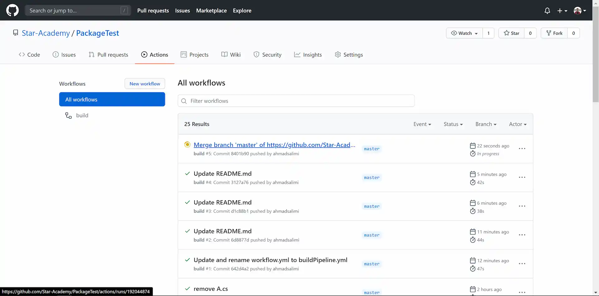
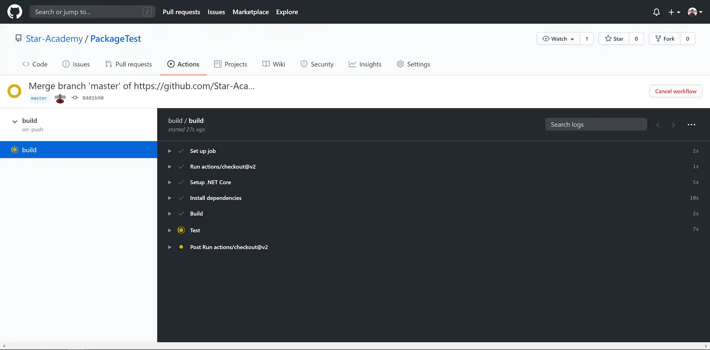
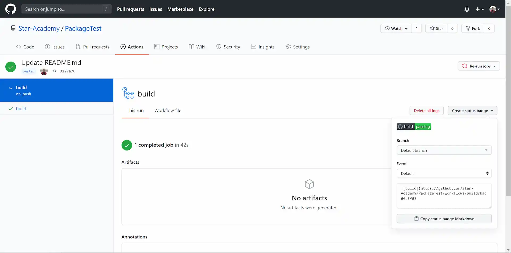
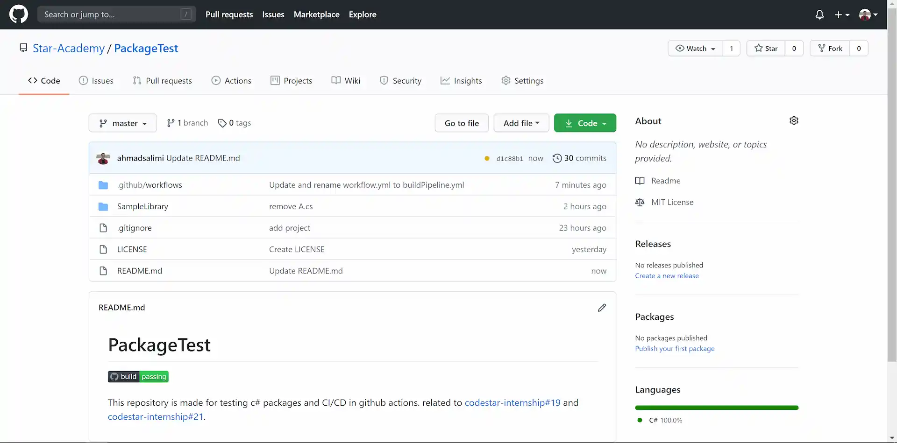
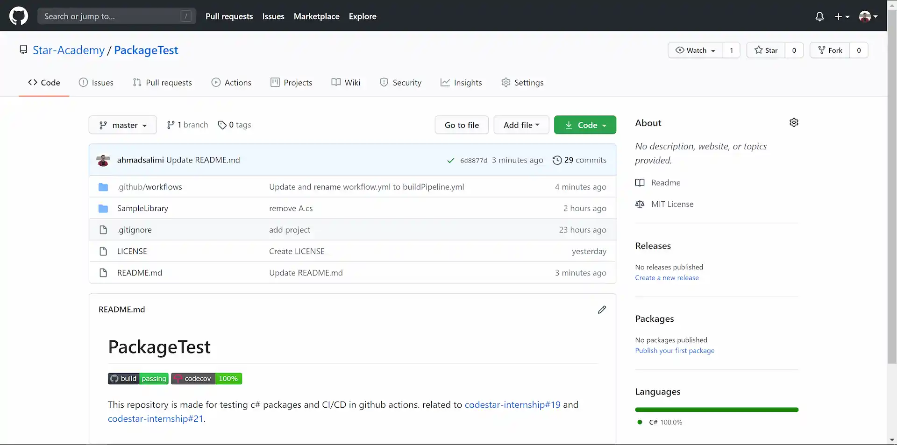

## مقدمه

در این فاز با مفهوم CI/CD
و اهمیت استفاده از آن آشنا می‌شوید و سپس پروژهٔ خود را به CI/CD
مجهز می‌کنید.

## CI/CD چیست و چرا اهمیت دارد

برای درک مفهوم CI/CD
و اهمیت آن لینک‌های زیر را مطالعه کنید.

-   [What is CI/CD?(redhat)](https://www.redhat.com/en/topics/devops/what-is-ci-cd)
-   [What’s the Point of CI Anyway?](https://medium.com/swlh/whats-the-point-of-ci-anyway-ac3f9eaa244c)
-   [The Journey to CI/CD](https://medium.com/driven-by-code/the-journey-to-ci-cd-b1872927c36b)

## آشنایی با GitHub Actions و اضافه کردن CI/CD Pipeline به Repository

یکی از ابزارهای CI/CD
معروف، GitHub Actions
است که به کمک آن، می‌توانیم یک Pipeline
شامل عملیات build،
اجرای unit testها،
انتشار package
و دیگر عملیاتی که در دستهٔ CI/CD
می‌گنجد را به Repository
خود اضافه کنیم. این بخش شامل مراحل زیر است:

1. فایل `github/workflows/buildPipeline.yml.`
   را در Repository
   خود می‌سازیم.

1. برای Pipeline
   خود یک نام تعریف می‌کنیم:

```yml
name: build
```

:::note ‌
به فایل `buildPipeline.yml`
اضافه کنید.
:::

1. مشخص می‌کنیم که Pipeline
   در هنگام push
   و pull request
   روی(یا به طور مشابه main) master
   اجرا شود:

```yml
on:
    push:
        branches: [master]
    pull_request:
        branches: [master]
```

1.  مراحل Pipeline
    را به ترتیب تعریف می‌کنیم:

    1. در ابتدا مشخص می‌کنیم که Pipeline
       روی آخرین ورژن ubuntu
       (می‌توان آن را تغییر داد) اجرا شود:

        ```yml
        jobs:
            build:
                runs-on: ubuntu-latest
        ```

    1. سپس مشخص می‌کنیم که CI
       از agentای
       به نام `actions/checkout@v3`
       استفاده کند:

        ```yml
        steps:
            - uses: actions/checkout@v3
        ```

        :::tip ‌
        برای مطالعه بیشتر [Packaging an Action](https://www.edwardthomson.com/blog/building_an_action.html)
        را بخوانید سپس سری به [Repository](https://github.com/actions/checkout)
        آن بزنید.
        :::

    1. در قدم بعد مشخص می‌کنیم که .Net 6.0
       نصب شود:

        ```yml
        - name: Setup .NET
          uses: actions/setup-dotnet@v2
          with:
              dotnet-version: 6.0.x
        ```

    1. سپس dependencyهای
       پروژه restore
       شوند:
       ‌

        ```yml
        - name: Install dependencies
          run: dotnet restore
          working-directory: <path to solution>
        ```

        :::note ‌
        دقت کنید که به جای `<path to solution>`
        آدرس فولدر solution
        خود را مشخص کنید.
        :::

    1. حال solution
       را build
       می‌کنیم:

        ```yml
        - name: Build
          run: dotnet build --configuration Release --no-restore
          working-directory: <path to solution>
        ```

    1. در نهایت تست‌ها را run
       می‌کنیم:

        ```yml
        - name: Test
          run: dotnet test --no-restore --verbosity normal --collect:"XPlat Code Coverage"
          working-directory: <path to solution>
        ```

    ```

    ```

تبریک! CI
شما آماده‌است.

فایل را commit
کرده و روی master
پوش کنید.

در Repository
خود وارد منوی Actions
شوید؛ همانطور که مشاهده می‌کنید، Pipeline
شما در حال اجرا است:



آن را باز کرده و وارد بخش build
شوید:



1. افزودن badge
   وضعیت CI
   به README:

از این قسمت دکمهٔ Copy status badge Markdown
را انتخاب کرده و متن کپی‌شده را به README
در Repository
خود اضافه کنید.



می‌توانید وضعیت Pipeline
را در هر لحظه مشاهده کنید:



1. افزودن مشاهده وضعیت code coverage:

با اکانت GitHub
خود در سایت [codecov.io](https://codecov.io)
وارد شوید. سپس به آدرس `https://codecov.io/gh/Star-Academy/<your-repository-name>`
بروید.

1. بخش زیر را به فایل `buildPipeline.yml`
   اضافه کنید:

```yml
- name: Publish code coverage reports to codecove.io
  uses: codecov/codecov-action@v1
  with:
      token: ${{ secrets.CODECOV_TOKEN }}
      files: ./**/coverage.cobertura.xml
      fail_ci_if_error: true
```

1. یک‌بار دیگر صفحهٔ `https://codecov.io/gh/Star-Academy/<your-repository-name>`
   را باز کنید
   وارد بخش Setting
   شده و از سمت چپ، گزینه‌ی Badge
   را انتخاب کنید. در صفحه‌ای که باز می‌شود، Markdown
   را کپی کرده و به README
   در Repository
   خود اضافه کنید. اکنون مشاهده خواهید کرد که در هر لحظه، وضعیت code coverage
   شما نیز نمایش داده می‌شود:



تا به اینجای کار، کل فایل `buildPipeline.yml`
باید بصورت زیر باشد:

```yml
name: build

on:
    push:
        branches: [master]
    pull_request:
        branches: [master]

jobs:
    build:
        runs-on: ubuntu-latest

        steps:
            - uses: actions/checkout@v3

            - name: Setup .NET
              uses: actions/setup-dotnet@v2
              with:
                  dotnet-version: 6.0.x

            - name: Install dependencies
              run: dotnet restore
              working-directory: <path to solution>

            - name: Build
              run: dotnet build --configuration Release --no-restore
              working-directory: <path to solution>

            - name: Test
              run: dotnet test --no-restore --verbosity normal --collect:"XPlat Code Coverage"
              working-directory: <path to solution>

            - name: Publish code coverage reports to codecove.io
              uses: codecov/codecov-action@v1
              with:
                  token: ${{ secrets.CODECOV_TOKEN }}
                  files: ./**/coverage.cobertura.xml
                  fail_ci_if_error: true
```

## انتشار package در NuGet.org

در این مرحله، می‌خواهیم یک Pipeline
جدید بسازیم که هنگام release
یک ورژن در Repository،
پکیج را در [NuGet.org](https://nuget.org)
منتشر کند.

ابتدا باید مشخصات package
را در فایل `csproj.`
مربوط به پروژهٔ خود مشخص کنید. بدین منظور، این فایل باید به صورت زیر باشد:

```xml
<Project Sdk="Microsoft.NET.Sdk">

  <PropertyGroup>
      <TargetFramework>net6.0</TargetFramework>
      <PackageId>StarAcademy.CodeStar[Year].Team[TeamNumber].[LibraryName]</PackageId>
      <Authors>[TeamMembers]</Authors>
      <Company>Star Academy</Company>
  </PropertyGroup>

</Project>
```

:::note ‌
در این فایل، به جای `[Year]`
سال شمسی، به جای `[TeamNumber]`
شمارهٔ تیم خود و به جای `[LibraryName]`
نام پروژهٔ خود را قرار دهید. شماره تیم به این خاطر باید قرار داده شود که اگر نام پروژه دو تیم یکسان بود، publish
دچار مشکل نشود و در نهایت `PackageId`
یکتا باشد.
:::

در ادامه، برای ساخت Pipline
مربوط به publish،
فایل `.github/workflows/publishPipeline.yml`
را می‌سازیم.
سپس مراحل زیر را به آن اضافه می‌کنیم:

1. نام، trigger
   و OS
   مربوط به Pipeline
   را مشخص می‌کنیم.

```yml
name: publish

on:
    release:
        types: published

jobs:
    publish:
        runs-on: ubuntu-latest
```

1. نصب .Net:

```yml
steps:
    - uses: actions/checkout@v3

    - name: Setup .NET
      uses: actions/setup-dotnet@v2
      with:
          dotnet-version: 6.0.x
```

1. گرفتن ورژن release
   کنونی:

```yml
- name: Get current release version
  id: version
  uses: pozetroninc/github-action-get-latest-release@master
  with:
      repository: Star-Academy/<repository name>
```

:::note ‌
تگ release
بعنوان ورژن به NuGet
داده می‌شود. در نتیجه، الگوهای قابل قبول ورژن را از
[اینجا](https://docs.microsoft.com/en-us/nuget/concepts/package-versioning)
بخوانید و تگ را مطابق این الگو بزنید.
:::
:::note ‌
به جای `<repository name>`
نام Repository
خود را قرار دهید.
:::

1. build و ساخت پکیج NuGet:

```yml
- name: Build library and generate NuGet Package
  run: dotnet pack -c Release -o artifacts -p:PackageVersion=${{ steps.version.outputs.release }}
  working-directory: <path to classlib project>
```

:::note ‌
به جای `<path to classlib project>`
آدرس فولدری که فایل `csproj.`
مربوط به پروژه class library
در آن قرار دارد را بنویسید.
:::

1. انتشار پکیج NuGet:

```yml
- name: Publish NuGet Package
  run: dotnet nuget push ./**/*.nupkg -k ${{ secrets.NUGET_API_KEY }} -s https://api.nuget.org/v3/index.json
```

از این پس، هر گاه در Repository
خود تگ بزنید، Pipeline
فوق trigger
می‌شود و در نتیجه پکیج شما push
می‌شود. همچنین در منوی Actions
می‌توانید وضعیت publish
را مشاهده کنید.

پکیج منتشر شدهٔ خود را می‌توانید در آدرس `nuget.org/packages/[PackageId]`
مشاهده کنید.

:::tip ‌ ‌
برای مطالعه بیشتر [Intro to GitHub Actions for .NET](https://devblogs.microsoft.com/dotnet/dotnet-loves-github-actions/)
را مطالعه کنید.
:::

## ساخت یک Console App برای پروژه سرچ

در این بخش، یک solution
دیگر بسازید، و در آن با Net Cli.
یک console app
بسازید. در پوشه پروژه کنسول، command
زیر را اجرا کنید تا پکیج سرچ شما به پروژه کنسول اضافه شود:

```shell
dotnet add package [packageId]
```

با این command،
پکیج به پروژه شما اضافه می‌شود و می‌توانید از کلاس‌های آن استفاده کنید. همچنین اگر پکیج خود را update
کرده باشید، با اجرای این command،
نسخه جدید پکیج به پروژه شما اضافه می‌شود.

حال با استفاده از پکیج کتابخانه سرچ‌تان، یک نرم‌افزار سرچ تحت کنسول پیاده‌سازی کنید.
